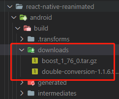

# 下载 boost 很慢处理

## 问题场景

在下载一些rn三方库的时候，有一些库是需要下载来自 `boost` 的包，但是这个下载过程会十分的缓慢。

以下是安装了快一个小时的进度！！！

`:react-native-reanimated:downloadBoost boost 1 76 0.tar.az 34.22 MB/124.24 HB downloaded`

## 解决方法

- 在 控制台 上，是有下载链接的。此时，你点击它，让它跳转到浏览器去下载压缩包。这个过程就正常网速快慢了。
- 在本地新建文件夹，将安装包放在文件夹里面，然后使用 `http-server`库，开启本地服务。
- 全局修改项目中的三方库（注意全局搜索能不能搜到 `node_modules` 里面的包），将需要此压缩包的`boost`下载路径，改成本地服务的，然后，重启打包下载。
- 防止搜索不到，这里提供下路径，`xxx\node_modules\react-native-reanimated\android\build.gradle`，其他都是类似操作。
- 上述的操作下，还是不行，再把下载路径还原，再重启打包，就能成功了。这个可能，有一部分的原因是部分包，因为你的全局修改，没有被下载到。

## 更直接的解决办法

直接把下载好的包，放进去。

