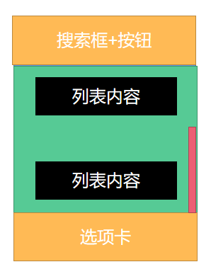
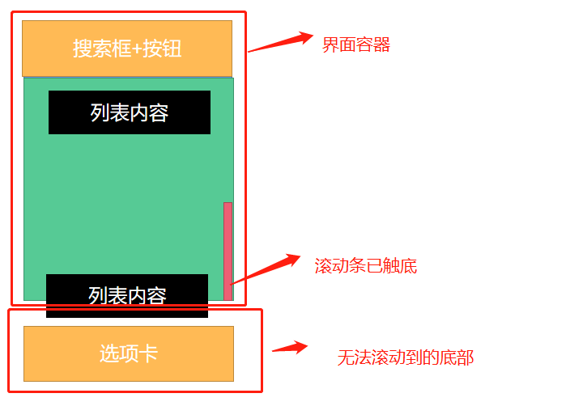

# ScrollView 组件

一个封装了平台的 ScrollView（滚动视图）的组件，同时还集成了触摸锁定的“响应者”系统。

记住 ScrollView 必须有一个确定的高度才能正常工作，因为它实际上所做的就是将一系列不确定高度的子组件装进一个确定高度的容器（通过滚动操作）。

要给 ScrollView 一个确定的高度的话，要么直接给它设置高度（不建议），要么确定所有的父容器都有确定的高度。一般来说我们会给 ScrollView 设置 `flex: 1` 以使其自动填充父容器的空余空间，但前提条件是所有的父容器本身也设置了 flex 或者指定了高度，否则就会导致无法正常滚动，你可以使用元素查看器来查找具体哪一层高度不正确。

## 布局失效、无法滚动到底部

> 因为 react-native 还处于 0.xx 的版本迭代。所以，无法确定今后是否会调整该功能，从而解决问题。
>
> 因此，记录当前时间 `2023-4-22`

### 定义布局：上下固定，中间撑开滚动

想要的效果图如下：



ScrollView 样式上的俩个属性：`style` 和 `contentContainerStyle` 。`style` 是定义组件的样式，而 `contentContainerStyle` 是定义组件内部的样式。

滚动列表的几种写法：

```jsx
// 第一种
const List = ()=>{
  return (
    <ScrollView style={{
      flexGrow:1
    }}>
      {/* 元素 */}
    </ScrollView>
  )
}

// 第二种
const List = ()=>{
  return (
    <ScrollView contentContainerStyle={{
      flexGrow:1
    }}>
      {/* 元素 */}
    </ScrollView>
  )
}

// 第三种
const List = ()=>{
  return (
    <ScrollView contentContainerStyle={{
      flex:1
    }}>
      {/* 元素 */}
    </ScrollView>
  )
}
```

上面三种写法，在正常情况下没问题。但是，当 ScrollView 组件之上，还有个固定的搜索宽，或者底部还有个固定的选项卡。继续采用上面的写法就会有问题，如下:

```jsx
const App = () => {
  return （
    <View style={{
      flex:1
    }}>
      {/* 搜索框+按钮 */}
      <List />
      {/* 选项卡 */}
    </View>
  ）
}
```

如上写法，在页面呈现上如下：



本意是，上下固定，中间撑开滚动。可实际上的效果是，底下部分，会被中间部分顶出去的。

且这种情况下的 ScrollView 组件，是无法滚动到底部的。因为在这种样式设置下，内部滚动的高度还是屏幕高度的！！！但它外部高度，却被分出俩块高度给顶上部分和底下部分。

### 解决问题

- 上下固定，中间撑开滚动
- 无法滚动到底

```jsx
const List = ()=>{
  return (
    <ScrollView style={{
      flex:1
    }}>
      {/* 元素 */}
    </ScrollView>
  )
}
```

呜呜呜~~~，真的这么简单！！！
