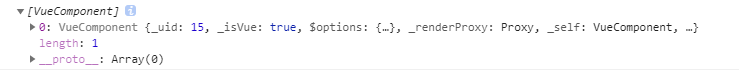
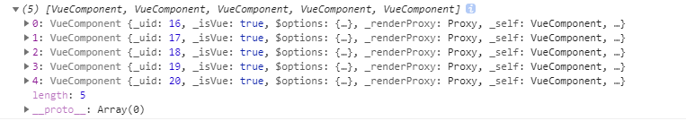

## ref属性

## 当同一组件内部，有多个同名ref引用时

###  this.$refs[ref名称]指向文档流中靠下的组件或DOM节点

```html
<template>
	<div class="container">
      <div class="form" ref="test">
        <el-input ref="test"></el-input>
      </div>
      <el-row ref="test"></el-row>
    </div>
</template>
```

this.$refs.test 指向的是`<el-row ref="test"></el-row>`


### 若是ref相同的组件或DOM节点间是父子关系，则指向父级组件或DOM节点

```html
<template>
	<div class="container">
      <div class="form" ref="test">
        <el-input ref="test"></el-input>
      </div>
    </div>
</template>
```
this.$refs.test 指向的是`<div class="form" ref="test">...</div>`

## 若ref用在v-for里

当循环内的ref值不同时，需提供this.refs[ref名称][0]来获取该DOM节点或组件实例；当ref值相同时，this.$refs[ref名称]获取到的是该DOM节点或组件的数组。

### 当循环内的ref值不同时，需提供this.$refs[ref名称][0]来获取该DOM节点或组件实例

```html
<template>
	<div class="container">
      <div class="form" ref="test">
        <el-input ref="test"></el-input>
      </div>
      <el-row v-for="item in 5" :key="item" :ref="'test' + item"></el-row>
    </div>
</template>
```

`this.$refs.test1` 指向，可以看到它控制台中打印出是一个数组，只有一项即时引用指向的节点或组件。同理会有 `this.$refs.test2、this.$refs.test3、、、this.$refs.test5`。




### 当写死ref，值相同时，this.$refs[ref名称]获取到的是该DOM节点或组件的数组

```html
<template>
	<div class="container">
      <div class="form" ref="test">
        <el-input ref="test"></el-input>
      </div>
      <el-row v-for="item in 5" :key="item" ref="test"></el-row>
    </div>
</template>
```

`this.$refs.test` 的指向，是同名DOM节点的数组，使用下表即可获取响应DOM节点或组件



##  使用注意事项

ref 属性值接收一个字符串

因为 ref 本身是作为渲染结果被创建的，在初始渲染的时候你不能访问它们 - 它们还不存在

```js
created () {
    console.log('test')
    console.log(this.$refs.test) // undefined
}
```

并且它不是响应式的。这仅作为一个用于直接操作子组件的“逃生舱”——你应该避免在模板进行数据绑定或计算属性中访问 `$refs`。

